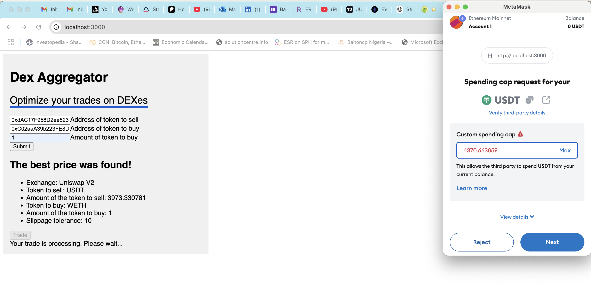

# Dex Aggregator

This dex aggregator compares the price of a token on Uniswap V2, Sushiswap V2 and Pancakeswap V2 and route the swap of a user to the dex with the best price. Below is a screenshot of the DAPP.



## Getting Started

First, clone the project and install dependencies:

```bash
# install dependencies
yarn 
```

run the development server:

```bash

yarn dev
```

Open [http://localhost:3000](http://localhost:3000) with your browser to see the result.

## Sample Input Data

### Eth mainnet
tokenIn => USDT : "0xdAC17F958D2ee523a2206206994597C13D831ec7"
tokenOut => WETH : "0xC02aaA39b223FE8D0A0e5C4F27eAD9083C756Cc2"
amountOut => 1


### Base mainnet
tokenIn => USDT : "0xfde4C96c8593536E31F229EA8f37b2ADa2699bb2"
tokenOut => WETH : "0x4200000000000000000000000000000000000006"
amountOut => 1

### BSC mainnet (Not yet implemented)
tokenIn => USDT : "0x55d398326f99059fF775485246999027B3197955"
tokenOut => WBNB : "0xbb4CdB9CBd36B01bD1cBaEBF2De08d9173bc095c"
amountOut => 1
DAI: "0x1AF3F329e8BE154074D8769D1FFa4eE058B1DBc3"
